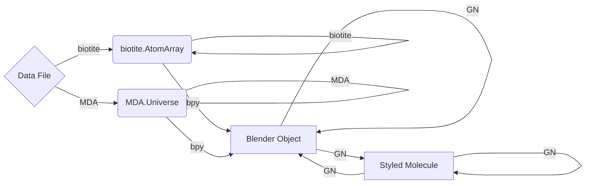

# Contributing to Molecular Nodes

## Reporting a Bug

This is an important way to contribute!

Please try and gather as many details as possible, including operating system, computer specs, versions of Blender and Molecular Nodes.
Collect any error messages that you get, screenshots that could be useful.
Open a [new issue](https://github.com/BradyAJohnston/MolecularNodes/issues) and include all information possible to replicate the issue, and what you think the result should be.

## Contributing New Functionality

I welcome and and all potential features and PRs. If you are interested in contributing a feature, or fixing a bug, please comment on an existing issue or create a new issue to discuss the implementation. There might be existing limitations as to why it is not covered already, or why the implementation might need to follow Blender's at times round-about API. Below are some notes on the structure of the add-on, as well as how operators and functions inside of Blender and Molecular Nodes currently operate.

## Developing Molecular Nodes

Fork and clone the project.
I recommend using VS Code and the [Blender VS Code](https://github.com/JacquesLucke/blender_vscode) addon which streamlines the development process.

Once installed and with the project open inside of VS Code, you can use the `Blender: Build and Start` command.
This will prompt the selection of a Blender executable to link the add-on to for development.
It should then boot Blender with the add-on installed and enabled.
Whenever you make a change inside of the project, you can use `Blender: Reload Addons` to reload the add-on inside of Blender with the updated code.

The DEBUG CONSOLE will print any errors in the loading of the add-on, or in the drawing of the UI and running operators inside of Blender.


### Structure

All of the code for the Blender add-on is contained inside of the `MolecularNodes` subfolder.
To create a release, the contents of this subfolder is zipped with the `make release` command.
The root level folder contains other files which are related to enabling the installation of the add-on as a `pip` package, for unit testing and in the future for installation from `pypi`.
Additionally the README and other GitHub related files live here.

``` bash
.
├── CHANGELOG.md
├── LICENSE
├── MANIFEST.in
├── Makefile
├── MolecularNodes
│   ├── __init__.py                 # <- initialises the add-on in Blender
│   ├── assembly                    # dealing with biological assemblies
│   │   ├── __init__.py
│   │   ├── cif.py
│   │   ├── mesh.py
│   │   ├── mmtf.py
│   │   └── pdb.py
│   ├── assets                       # <- contains .blend files for defaults and pre-made assets
│   │   ├── MN_data_file.blend
│   │   └── template
│   │       ├── MolecularNodes
│   │           └── startup.blend
│   ├── auto_load.py
│   ├── coll.py
│   ├── color.py
│   ├── data.py
│   ├── density.py
│   ├── esmfold.py
│   ├── load.py
│   ├── md.py
│   ├── mda.py
│   ├── nodes.py
│   ├── obj.py
│   ├── pkg.py
│   ├── pref.py
│   ├── requirements.txt
│   ├── star.py
│   ├── ui.py
│   └── utils.py
├── README.md
├── docs
├── pyproject.toml
├── requirements.txt
└── tests
```

Each `.py` contains the code for importing a particular data format, as well as defining the properties and UI panel that are needed for importing those types of data.

### Data Flow

The way that data flows and is handled is unconventional, and likely different to other python packages that you might have experience with.

There are two main components to the add-on, split into `Import` and `Manipulation`.

In terms of new features that have to do with MDAnalysis, these will likely focus on the import step.

If you would like to see how you can create a simple animation from some of the example data that ships with MDAnalysis, checkout the example file.

#### Import

Importing is the more traditional aspect of the add-on.
With the help of several python packages such as `biotite`, `MDAnalysis` and others, various molecular data formats are parsed.

Once parsed, the data is turned into a 3D mesh, with a vertex for each atom and an edge for each bond (if information available).
Now inside Blender as a 'native' 3D mesh, Geometry Nodes handles all further manipulation of the data, with additional animations, duplication, selections, and creation of new geometry in the form of styles.

Depending on the data format, it is parsed by different python packages, to their intermediate data structures.
Each data format can be manipulated during import while in the form of those intermediate data formats, but eventually will be converted to a traditional 3D model inside of Blender by the `bpy` module.
Once inside of Blender, all further manipulation and animation is handled by Geometry Nodes, in the form of mostly pre-made node groups and some programmatically created node groups.

#### Data flow importing structures



#### Manipulation

Manipulation is handled entirely by the Geometry Nodes (GN) system that exists inside of Blender.
Inside of Geometry Nodes, users can create node trees to modify, animate and style their macromolecular structures, through a range of pre-made node groups which are included inside of the add-on.

The nodes take the underlying atomic data, which is stored as a 3D mesh with each vertex representing an atom, and each edge between those vertices representing a bond (where applicable).
Both the vertices and edges can store arbitrary attributes, which we use to store the atomic information with the atoms and bonds.
Currently only numeric, boolean and vector attributes are supported, but in the future strings and more complex attributes will also be supported.

Interacting with the nodes via scripting is still quite difficult, the API on this on Blender's side still needs a lot of improvements.
So far the best approach has been to 'manually' make the node groups inside of Blender, and then save them and append the pre-made node groups from other `.blend` files to the current working file.
This isn't a fantastic strategy as the `.blend` files are opaque to `git`, so we just need to rely upon tests for checking if something is broken.

### `bpy`

In Blender add-on development, `import bpy` is your gateway to the Blender Python API. Anything that you can do via Blender's UI, you can usually achieve via calls to `bpy`.

``` python
import bpy

bpy.data                        # Access all of the data blocks inside of Blender
bpy.data.objects                # access all of the objects in the scene by name

cube = bpy.data.objects['Cube'] # get the data block for object called 'Cube'
cube.data                       # the data associated with the 'Cube' objects, such as edges, vertices, faces
cube.data.attributes
cube.data.vertices

bpy.ops                         # all of the pre-defined operators inside of Blender

bpy.context                     # all of the global context values, i.e. different properties set in the UI
bpy.types                       # the different pre-defined types used through bpy
```

`bpy` exposes a wide range of classes and functions, enabling you to perform tasks like creating objects, applying materials, setting animations, and much more, all programmatically.

For example, `bpy.data` grants access to the data blocks within Blender, such as meshes, materials, and textures, while `bpy.ops` allows you to call operators to perform specific actions, like rendering an image or duplicating an object.

Until earlier this year, `bpy` was only available when running scripts from inside of Blender, but it is now a `pip` installable package, which helps us with running test suites and for potential integrations with Jupyter Notebooks and other scripting environments.

### Creating a Basic Operator:

In Blender, operators are actions that can be triggered by the user or other parts of the code.
They can range from simple tasks like moving an object to complex operations like rendering an animation.

Operators can execute code of any arbitrary length.
They can provide additional *context* in the form of the `context` argument, which is given by Blender depending on where the operator is invoked.
If you press a button in one window of Blender, it might do something different compared to a different window of Blender.
Most of the operators inside of Molecular Nodes do not change their behaviour.

The design of Molecular Nodes is mostly to expose all of the functionality inside individual function calls.
To download a protein from the PDB, import it to Blender and create starting style, you can use the `mn.load.molecular_rcsb()` function.
Inside of the UI for Blender, when the user clicks the <kbd>Download from PDB</kbd> button, the operator just calls this function with the inputs taken from the local context, such as starting style and PDB code to download.
The operators themselves should not be doing any kind of complex operations, as that functionality won't then be available for use via scripts.

Below is the minimum required to create an add-on for Blender.
We define a custom function, create an operator that executes code (calling the function), we create some UI that displays a button to execute the operator, and we create `register()` and `unregister()` functions to install and uninstall the add-on.

``` python
import bpy

def my_function():
    print("hello world!")

class SimpleOperator(bpy.types.Operator):
    bl_idname = "wm.simple_operator"
    bl_label = "Simple Operator"

    def execute(self, context):
        #code to be executed by the operator goes in the `execute()` function
        my_function()

        # operators inside of Blender return `{'FINISHED'}` to signal they have completed
        # correctly and Blender can return control of the program back to the user.
        # This is why they are useful for UI operations, but less useful for scripting
        # other potential returns are 'CANCELLED', 'RUNNING_MODAL', 'PASS_THROUGH'
        return {'FINISHED'}

# define a menu that will appear inside of the Blender's UI
# the layout function `layout.operator()` will take a string name of the operator, 
# and create a button in the UI which will execute the operator when the buttons is pressed
def menu_func(self, context):
    # you can input either the string for the operator name, or take that 
    # name from the class itself
    self.layout.operator(SimpleOperator.bl_idname)
    self.layout.operator("wm.simple_operator")


# The `register()` and `unregister()` functions are run whenever Blender loads the 
# addon. This occurs the first time the add-on is installed and enabled, and then whenever
# Blender is started while the add-on is enabled. For Blender to be aware of the operator's
# existence, it has to be registered (and unregistered when uninstalled). The same has to 
# happen for the UI components
def register():
    bpy.utils.register_class(SimpleOperator)
    bpy.types.VIEW3D_MT_mesh.append(menu_func)

def unregister():
    bpy.utils.unregister_class(SimpleOperator)
    bpy.types.VIEW3D_MT_mesh.remove(menu_func)
```

##### Returning Signals from Operators in bpy

In Blender's Python API (`bpy`), operators primarily return a dictionary to signal their execution status.
The common keys used in this dictionary are:

1.  `'FINISHED'`: Indicates that the operator completed successfully.

2.  `'CANCELLED'`: Indicates that the operator was canceled by the user or encountered an error.

3.  `'RUNNING_MODAL'`: Typically used for modal operators that run continuously until they are explicitly ended by the user.

4.  `'PASS_THROUGH'`: Used in certain cases to indicate that the operator does not consume events.

Additionally, some operators may use custom status strings, but these are less common and specific to certain situations.